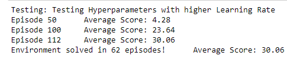
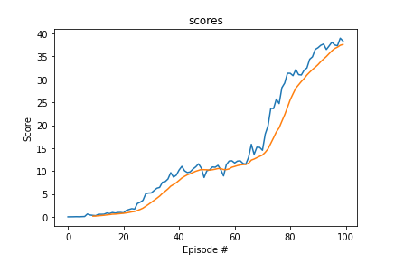

[//]: # (Image References)

[image1]: https://user-images.githubusercontent.com/10624937/43851024-320ba930-9aff-11e8-8493-ee547c6af349.gif "Trained Agent"
[image2]: https://user-images.githubusercontent.com/10624937/43851646-d899bf20-9b00-11e8-858c-29b5c2c94ccc.png "Crawler"

# Project Overview: Continuous Control

## Introduction

For this project, we work with the [Reacher](https://github.com/Unity-Technologies/ml-agents/blob/master/docs/Learning-Environment-Examples.md#reacher) environment.

![Trained Agent][image1]

In this environment, a double-jointed arm can move to target locations. A reward of +0.1 is provided for each step that the agent's hand is in the goal location. Thus, the goal of your agent is to maintain its position at the target location for as many time steps as possible. The observation space consists of 33 variables corresponding to position, rotation, velocity, and angular velocities of the arm. Each action is a vector with four numbers, corresponding to torque applicable to two joints. Every entry in the action vector should be a number between -1 and 1.

### Distributed Training

In this project we have two separate versions of the Unity environment:
- The first version contains a single agent.
- The second version contains 20 identical agents, each with its own copy of the environment.  

The second version is useful for algorithms like [PPO](https://arxiv.org/pdf/1707.06347.pdf), [A3C](https://arxiv.org/pdf/1602.01783.pdf), and [D4PG](https://openreview.net/pdf?id=SyZipzbCb) that use multiple (non-interacting, parallel) copies of the same agent to distribute the task of gathering experience.

In this project I have chosen to use a Policy Based method called [DDPG (Deep Deterministics Policy Gradient)](https://spinningup.openai.com/en/latest/algorithms/ddpg.html)

## Solving the Environment

### Methodology

The barrier for solving the this version of the environment is to take into account the presence of many agents.  In particular, the learning agent must get an average score of +30 (over 100 consecutive episodes, and over all agents).  Specifically,
- After each episode, we add up the rewards that each agent received (without discounting), to get a score for each agent.  This yields 20 (potentially different) scores.  We then take the average of these 20 scores. 
- This yields an **average score** for each episode (where the average is over all 20 agents).

The observation space consists of 33 variables corresponding to position, rotation, velocity, and angular velocities of the arm. Each action is a vector with four numbers, corresponding to torque applicable to two joints. Every entry in the action vector should be a number between -1 and 1.

- Set-up: Double-jointed arm which can move to target locations.
- Goal: The agents must move it's hand to the goal location, and keep it there.
- Agents: The environment contains 10 agent linked to a single Brain.
  - The provided Udacity agent versions are Single Agent or 20-Agents
- Agent Reward Function (independent):
  - +0.1 Each step agent's hand is in goal location.
- Brains: One Brain with the following observation/action space.
  - Vector Observation space: 26 variables corresponding to position, rotation, velocity, and angular velocities of the two arm Rigidbodies.
  - Vector Action space: (Continuous) Size of 4, corresponding to torque applicable to two joints.
  - Visual Observations: None.
- Reset Parameters: Two, corresponding to goal size, and goal movement speed.
- Benchmark Mean Reward: 30

The environment is considered solved, when the average (over 100 episodes) of those average scores is at least +30. In my implementation I have chosen to solve the **Second** version of the environment (Multiple Agents) using the off-policy DDPG algorithm. The task is episodic, and in order to solve the environment, the agent must get an average score of +30 over 100 consecutive episodes.

### Agent Implementation

This project implements an off-policy method called Deep Deterministic Policy Gradient and described in the paper [Continuous control with deep reinforcement learning](https://arxiv.org/abs/1509.02971) Deep Deterministic Policy Gradient (DDPG) is an algorithm which concurrently learns a Q-function and a policy. It uses off-policy data and the Bellman equation to learn the Q-function, and uses the Q-function to learn the policy.

### Implementation

The code is written in [Python 3.6](https://www.python.org/downloads/release/python-360/) and is relying on [PyTorch 0.4.0](https://pytorch.org/docs/0.4.0/) framework.

- `model.py` : Implement the Actor and the Critic classes.
    - The Actor and Critic classes each implements a Target and a Local Neural Networks used for the training.

- `ddpg_agent.py` : Implement the DDPG agent and a Replay Buffer memory used by the DDPG agent.
    - The Actor's Local and Target neural networks, and the Critic's Local and Target neural networks are instanciated by the Agent's constructor
    - The `learn()` method updates the policy and value parameters using given batch of experience tuples.

- `Continuous_Control.ipynb` : This Jupyter notebooks allows to instanciate and train the agent. More in details it allows to :

    - Prepare the Unity environment and Import the necessary packages
    - Check the Unity environment
    - Define a helper function to instanciate and train a DDPG agent
    - Train an agent using DDPG (including Hyperparameters evaluation)
    - Create a dictionary with all hyperparaeters to evaluate the agent
    - Plot the score results

### Results

The final hyperparameters and parameters were fine tuning and the results are presented below:

The agent took 112 episodes to solve the environment and achieve 30 points of score.

These results meets the project's expectation as the agent is able to receive an average reward (over 100 episodes) of at least +30, and in 112 episodes only

## Future Work

As discussed in the Udacity instructions, a further evolution to this project would be to train the 20-agents version. In that case, it might be better to use another algorithm like PPO, A3C, and D4PG that use multiple (non-interacting, parallel) copies of the same agent to distribute the task of gathering experience.